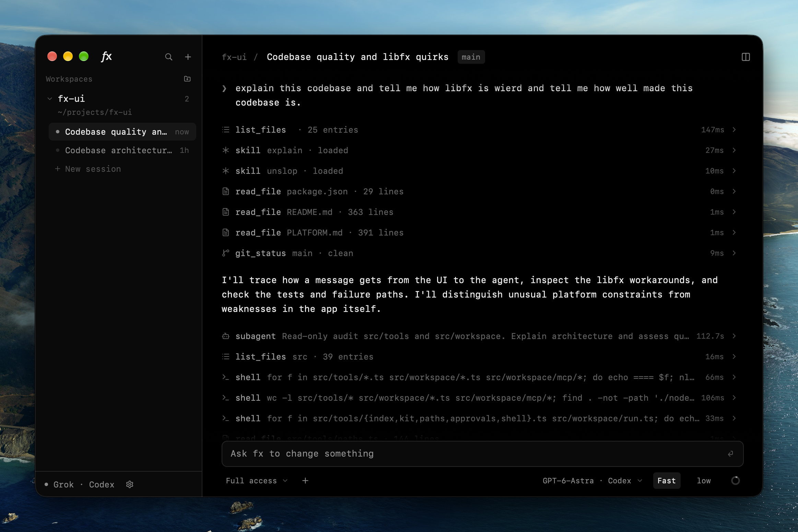

# fx-ui

A desktop app for the [fx](https://fx.sh) coding agent. The agent is
[libfx](https://fx.sh/docs/lib), running inside the app as a native addon, and
the window is drawn on the GPU by GPUI, the renderer Zed uses, through
[GPUIX](https://gpuix.dev).



The embedded fx core has no filesystem, shell or tools of its own, so the app
gives it tools scoped to one workspace directory and puts every edit and
command behind an approval you see before it runs.

## Running it

```bash
bun install
bun run dev
```

Then paste a Vercel AI Gateway key in settings (or export
`AI_GATEWAY_API_KEY` first), or sign in with a Grok or Codex subscription there.

| Script | What it does |
| --- | --- |
| `bun run dev` | Start the app with hot remount |
| `bun run build` | Compile a standalone binary into `dist/fx` |
| `bun run test` | Drive the app through the GPU test renderer with Vitest |
| `bun run typecheck` | `tsc --noEmit` |
| `bun run screenshot` | Drive the real window and write a PNG |

It is desktop-only: it needs the filesystem, a shell and the native libfx
addon.

## What it does

- Workspaces are directories. The agent reads, edits and runs commands inside
  one and nowhere else.
- Sessions resume after a restart and name themselves from your first prompt.
  `⌘\` opens a second pane beside the first.
- Models come from a Gateway key, a Grok or Codex subscription, or the fx CLI.
  Pick the reasoning effort, and Codex's fast tier where a model has one.
- Edits and commands wait for your approval in `ask`, `auto` or `full access`
  mode. Anything you allowed without asking is listed, and can be taken back.
- Attach images with ⌘V or the **+** menu, mention files with `@`, and run
  skills with `/`, including skills written for Claude Code and Codex.
- MCP servers, local or remote, with sign-in for the ones that need it.
- A context meter, with your plan's usage on Grok and Codex.
- Turns keep running when you switch sessions, background commands can be
  stopped, and the palette (`⌘K`) undoes the last write.

[docs/how-it-works.md](docs/how-it-works.md) explains each of these, the tools
the agent gets, and where the code lives. [PLATFORM.md](PLATFORM.md) records
what GPUIX, libfx, Grok and Codex do that you could not guess from reading.
Read it before changing rendering, the request shim, or either sign-in.

## State

State lives in `~/.fx-ui`: `state.json` (mode 600, since it can hold an API
key), `providers.json` and `mcp-auth.json` (also mode 600, for the OAuth tokens
of the two subscriptions and each remote MCP server), `mcp.json` for the
servers themselves, and one checkpoint per session. `FX_UI_HOME` moves that
directory, which is what the tests and the screenshot script use so they never
touch your real workspaces. While it is set, the `.claude` and `.agents` skill
folders are looked for inside it instead of in your home folder.

## The patched gpuix binary

The app runs its own build of `@gpuix/native` 0.7.0 with three changes, from
`patches/gpuix-native.diff`:

- The text field draws the caret at the height of its own font instead of the
  full 26px row, so a wrapped draft does not get a caret twice the size of its
  text.
- The text field binds ⌘V to its own paste and used to swallow the key even
  when the clipboard held only an image. When there is no text to paste, the
  key now carries on to `onKeyDown`.
- The renderer gains `promptForPaths(elementId, multiple)`, which opens GPUI's
  own macOS file panel and reports the chosen paths as a `change` event on that
  element, so choosing images does not wait for `osascript` to build a panel.

`vendor/gpuix-native.darwin-arm64.node` is that build, and `postinstall` copies
it next to the package's loader, which tries that path before the published
binary. It is built with GPUI's `runtime_shaders` because this machine's Xcode
has no Metal toolchain, so its shaders compile when the window opens instead of
at build time. It is linked against the macOS 26.5 SDK, like the published
binary. macOS 27 refuses an addon linked against its own beta SDK, and the
loader then falls back to the published binary without a word, which the ⌘V
test is there to catch. To rebuild it:

```sh
git clone https://github.com/remorses/gpuix && cd gpuix
git checkout @gpuix/native@0.7.0
git submodule update --init --depth 1 zed
git apply ../fx-ui/patches/gpuix-native.diff
cd packages/native
export DEVELOPER_DIR=/Library/Developer/CommandLineTools
export SDKROOT=$DEVELOPER_DIR/SDKs/MacOSX26.5.sdk
rustup run 1.97.1 cargo build --release --features gpui_platform/runtime_shaders
cp target/release/libgpuix_native.dylib ../../../fx-ui/vendor/gpuix-native.darwin-arm64.node
```

Drop the feature once `xcodebuild -downloadComponent MetalToolchain` has run,
to match the published build exactly. Upgrading gpuix means redoing this, or
deleting all of it if upstream takes the change.
